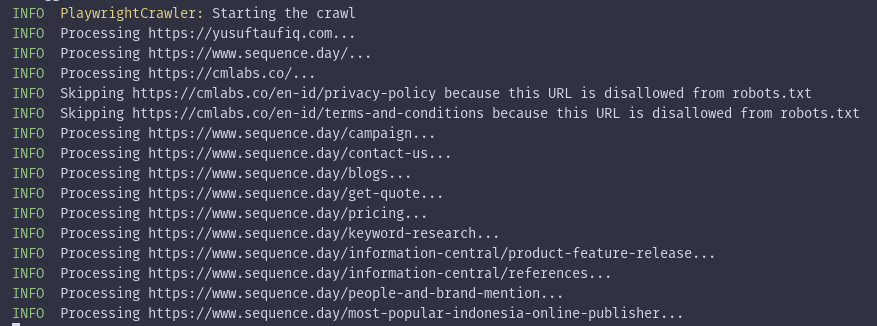

## Table of Contents

- [Description](#description)
- [How it works](#how-it-works)
- [Technical details](#technical-details)
- [Installation](#installation)
- [Usage](#usage)
- [TODO](#todo)

## Description

Non-blocking CLI based application to recursively crawl data from whole pages on websites in parallel and save the results to HTML output.



## How it works

- Open pages using [Playwright](https://playwright.dev/).
- On pages, find new link elements that have an HTML `a` tag on the page.
- Filter only links that point to the same domain and are allowed in `robots.txt`.
- Add links to the request queue.
- Skips duplicate URLs.
- Visit recently queued links.
- Repeat the process.

## Technical details

- Tech stack: [Node.js](https://nodejs.org/en), [TypeScript](https://www.typescriptlang.org/), [NestJs](https://nestjs.com/), [Playwright](https://playwright.dev/)

## Installation

- Requirements

  - Node.js >= 18

- Clone this repository

  ```bash
  $ https://github.com/yusuftaufiq/cmlabs-backend-crawler-freelance-test.git
  ```

- Change to the cloned directory and install all required dependencies (may take a while)

  ```bash
  $ npm install
  ```

- Build the application

  ```bash
  $ npm run build
  ```

- Start the CLI application, all the features can be seen in the following [section](#usage)
  ```bash
  $ npm run start:prod -- crawl
  ```
  If the command is launched successfully, all results will be available in [./storage/key_value_stores](./storage/key_value_stores)

## Usage

- Show all available commands
  ```bash
  $ npm run start:prod -- --help
  $ npm run start:prod -- crawl --help
  ```
- Customize targets to be crawled. (default: https://cmlabs.co/ https://www.sequence.day/ https://yusuftaufiq.com)
  ```bash
  $ npm run start:prod -- crawl https://books.toscrape.com/ https://quotes.toscrape.com/
  ```
- Control the verbosity of log messages (choices: "off", "error", "soft_fail", "warning", "info", "debug", "perf", default: "info")
  ```bash
  $ npm run start:prod -- crawl --log-level warning
  ```
- Sets the maximum concurrency (parallelism) for the crawl (default: 15)
  ```bash
  $ npm run start:prod -- crawl --max-concurrency 100
  ```
- Maximum number of pages that the crawler will open. The crawl will stop when this limit is reached. (default: 50)
  ```bash
  $ npm run start:prod -- crawl --max-requests 1000
  ```
- Timeout by which the function must complete, in seconds. (default: 30)
  ```bash
  $ npm run start:prod -- crawl --timeout 10
  ```
- Whether to run the browser in headful mode. (default: false)
  ```bash
  $ npm run start:prod -- crawl --headful
  ```

## TODO
- Prioritize sitemap.xml
- Add proxies
- Watch out for honeypots
- Adopt CAPTCHA solving service